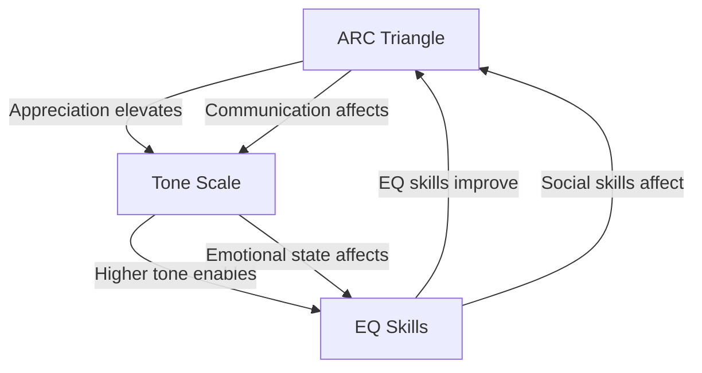
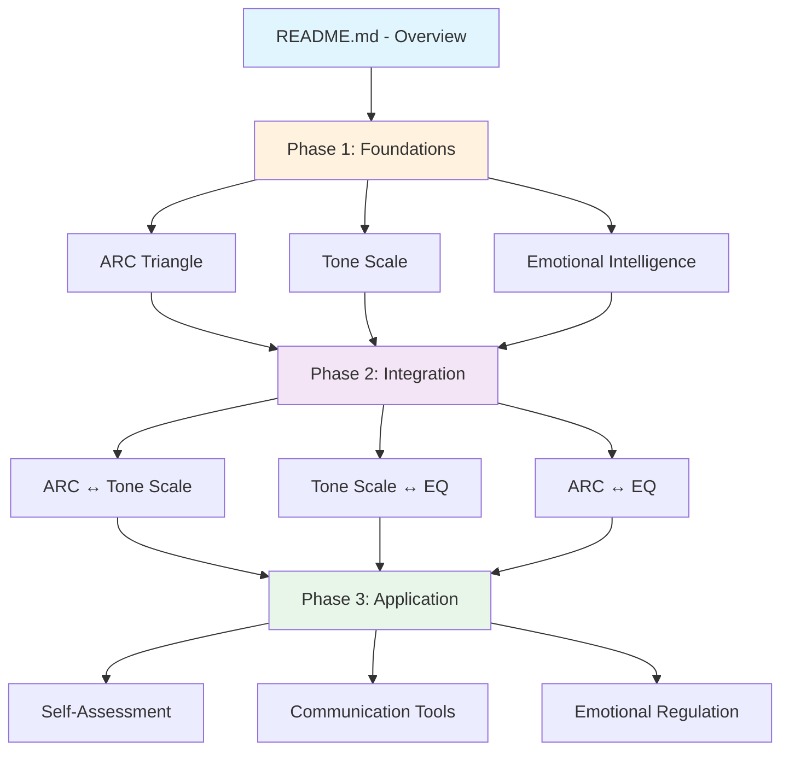

# Study Guide: ARC Triangle, Tone Scale & Emotional Intelligence

This guide provides a structured approach to learning the three interconnected frameworks in your LEARN project.

## Learning Objectives

By completing this study path, you will be able to:

1. Understand the ARC Triangle framework for relationship dynamics
2. Identify emotional states using the Tone Scale
3. Apply Emotional Intelligence models for personal development
4. Integrate all three frameworks for comprehensive understanding
5. Apply concepts to real-world communication and self-regulation

---

## Phase 1: Foundations (Weeks 1-2)

### Week 1: ARC Triangle

**Goal**: Understand how relationships function through three interdependent elements.

#### Study Order:

1. **Start with**: [`ARC-TRIANGLE/README.md`](./ARC-TRIANGLE/README.md)
   - Overview of the three components
   - How they interconnect
   - Why balance matters

2. **Then study each component**:
   - [`appreciation.md`](./ARC-TRIANGLE/appreciation.md) - Value and care for others
   - [`reality.md`](./ARC-TRIANGLE/reality.md) - Shared understanding and truth
   - [`communication.md`](./ARC-TRIANGLE/communication.md) - Exchange of information

3. **Optional visual aid**: [`arc-triangle-diagram.md`](./ARC-TRIANGLE/arc-triangle-diagram.md)

#### Key Concepts:

| Component     | Symbol | Focus                             |
| ------------- | ------ | --------------------------------- |
| Appreciation  | A      | Value, care, regard for others    |
| Reality       | R      | Shared understanding and truth    |
| Communication | C      | Exchange of information and ideas |

**Success Criteria**: You can explain how each element affects the others and why balance is important.

---

### Week 2: Tone Scale

**Goal**: Learn to identify and understand emotional states on a gradient scale.

#### Study Order:

1. **Start with**: [`TONE-SCALE/README.md`](./TONE-SCALE/README.md)
   - Overview of the scale structure
   - Purpose and historical context
   - How to use it practically

2. **Then study**:
   - [`full-scale.md`](./TONE-SCALE/full-scale.md) - Complete scale from -40 to +40
   - [`key-levels.md`](./TONE-SCALE/key-levels.md) - Important levels explained
   - [`applying-tone-scale.md`](./TONE-SCALE/applying-tone-scale.md) - Practical application

#### Key Ranges:

```
+40.0 ────────────── Serenity of Beingness (highest state)
   │
+30.0 ────────────── Ecstatic
   │
+15.0 ────────────── Gay
   │
+10.0 ────────────── Cheerful
   │
+5.0  ────────────── Interest
   │
+4.0  ────────────── Enthusiasm (productive zone begins)
   │
+3.0 ─────────────── Conservative
   │
+2.5 ─────────────── Boredom
   │
+2.0 ─────────────── Antagonism (productive zone ends)
   │
+1.5 ─────────────── Anger
   │
+1.0 ─────────────── Fear
   │
+0.5 ─────────────── Grief
   │
 0.0  ─────────────── Body Death (neutral point)
   │
-1.0 ─────────────── Blame
   │
-6.0  ────────────── Sacrifice
   │
-40.0 ────────────── Total Failure (lowest state)
```

**Success Criteria**: You can identify tone levels in real situations and understand the difference between productive (+2 to +4) and non-productive ranges.

---

### Week 3: Emotional Intelligence

**Goal**: Understand modern frameworks for developing emotional skills.

#### Study Order:

1. **Start with**: [`EMOTIONAL-INTELLIGENCE/README.md`](./EMOTIONAL-INTELLIGENCE/README.md)
   - Overview of EQ concepts
   - Historical context
   - Connection to ARC and Tone Scale

2. **Then study each model**:
   - [`goleman-model.md`](./EMOTIONAL-INTELLIGENCE/goleman-model.md) - 5 components
   - [`six-seconds-model.md`](./EMOTIONAL-INTELLIGENCE/six-seconds-model.md) - 3 pursuits, 8 competencies
   - [`freedman-fariselli.md`](./EMOTIONAL-INTELLIGENCE/freedman-fariselli.md) - 8 EQ competencies
   - [`arc-trauma-model.md`](./EMOTIONAL-INTELLIGENCE/arc-trauma-model.md) - Attachment, Regulation, Competency

#### EQ Models Comparison:

| Model       | Focus                      | Key Components                                                      |
| ----------- | -------------------------- | ------------------------------------------------------------------- |
| Goleman     | 5 components               | Self-Awareness, Self-Regulation, Motivation, Empathy, Social Skills |
| Six Seconds | 3 pursuits, 8 competencies | Know Yourself, Choose Yourself, Give Yourself                       |
| ARC Trauma  | Trauma therapy             | Attachment, Regulation, Competency                                  |

**Success Criteria**: You understand the differences between models and can identify which skills map to which components.

---

## Phase 2: Integration (Week 4)

**Goal**: Understand how the frameworks interconnect and complement each other.

### Study Order:

1. **Start with**: [`INTERCONNECTEDNESS/README.md`](./INTERCONNECTEDNESS/README.md)
   - Overview of how frameworks connect
   - Common themes and complementary perspectives

2. **Then study each connection**:
   - [`arc-and-tone.md`](./INTERCONNECTEDNESS/arc-and-tone.md) - ARC ↔ Tone Scale
   - [`tone-and-eq.md`](./INTERCONNECTEDNESS/tone-and-eq.md) - Tone Scale ↔ EQ
   - [`arc-and-eq.md`](./INTERCONNECTEDNESS/arc-and-eq.md) - ARC ↔ EQ

### Key Relationships:



**Key Insights**:

| Connection       | What You'll Learn                                                  |
| ---------------- | ------------------------------------------------------------------ |
| ARC ↔ Tone Scale | How communication and appreciation quality affect emotional states |
| Tone Scale ↔ EQ  | How emotional intelligence skills help maintain higher tones       |
| ARC ↔ EQ         | How relationship skills map to emotional competencies              |

**Success Criteria**: You can explain how improving one framework positively affects the others.

---

## Phase 3: Application (Weeks 5+)

**Goal**: Apply concepts to real-world situations for personal development.

### Study Order:

1. **Start with**: [`PRACTICAL-APPLICATIONS/README.md`](./PRACTICAL-APPLICATIONS/README.md)
   - Overview of practical tools
   - Getting started guide

2. **Then study each application**:
   - [`self-assessment.md`](./PRACTICAL-APPLICATIONS/self-assessment.md) - Identify your patterns
   - [`communication-tools.md`](./PRACTICAL-APPLICATIONS/communication-tools.md) - Improve relationships
   - [`emotional-regulation.md`](./PRACTICAL-APPLICATIONS/emotional-regulation.md) - Manage emotions

### Practical Skills:

| Application          | Goal                                                 | Key Tools                                                     |
| -------------------- | ---------------------------------------------------- | ------------------------------------------------------------- |
| Self-Assessment      | Identify your typical tone and relationship patterns | Tone journaling, reflection exercises                         |
| Communication Tools  | Apply ARC principles to improve relationships        | Appreciation approach, reality-building, communication bridge |
| Emotional Regulation | Manage emotions to maintain higher tones             | Physical techniques, cognitive reframing, social connection   |

**Success Criteria**: You can consistently apply these tools in daily life and observe positive changes.

---

## Complete Study Path Visualization



---

## Time Commitment Guide

| Phase   | Duration | Weekly Commitment |
| ------- | -------- | ----------------- |
| Phase 1 | 3 weeks  | 3-5 hours         |
| Phase 2 | 1 week   | 2-3 hours         |
| Phase 3 | Ongoing  | 1-2 hours         |

---

## Additional Resources

### Reference Materials

- **[AUDIT-2026-02-25.md](./AUDIT-2026-02-25.md)** - Comprehensive comparison of frameworks
- **[GLOSSARY.md](./GLOSSARY.md)** - Terminology definitions

### Historical Sources

- Hubbard, L. Ron. "Science of Survival" (1951) - Original Tone Scale source
- Goleman, Daniel. "Emotional Intelligence" (1995)
- Six Seconds Network - Modern EQ frameworks
- Trauma Center, JRI - ARC Model for trauma therapy

---

## Tips for Success

1. **Read in order**: Each module builds on previous concepts
2. **Take notes**: Document your insights and observations
3. **Practice daily**: Apply concepts in real situations
4. **Reflect weekly**: Review what you've learned and observed
5. **Be patient**: These are deep concepts that take time to master
6. **Use the audit**: Refer to AUDIT-2026-02-25.md for clarifications

---

## Quick Reference

### ARC Triangle

- **A**ppreciation: Value, care, regard
- **R**eality: Shared understanding
- **C**ommunication: Information exchange

### Tone Scale Key Points

- **+4.0 to +3.0**: Productive zone (Enthusiasm to Conservative)
- **+2.0**: Antagonism (edge of productive zone)
- **0.0**: Body Death (neutral point)
- **-40.0**: Total Failure (lowest state)

### EQ Models

- **Goleman**: Self-Awareness, Self-Regulation, Motivation, Empathy, Social Skills
- **Six Seconds**: Know Yourself, Choose Yourself, Give Yourself
- **ARC Trauma**: Attachment, Regulation, Competency

---

_This study guide is designed for self-paced learning. Each module builds upon previous concepts. Refer to the main README.md for the project overview and AUDIT-2026-02-25.md for detailed comparisons._
