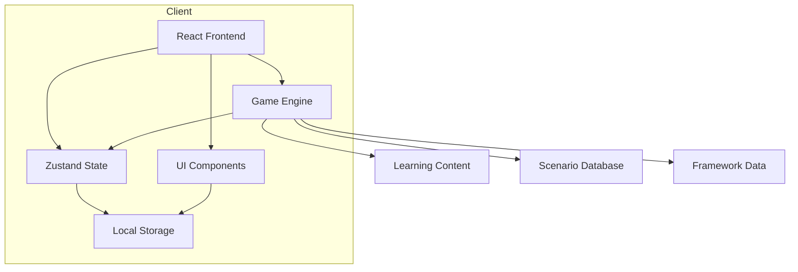

# High-Level Design Document

**Project:** ARC, Tone Scale & EQ Learning Project  
**Created:** 2026-02-25  
**Version:** 1.0.0

---

## Overview

This document provides a consolidated overview of the project architecture, design decisions, and structure for the ARC, Tone Scale & EQ Learning Project. It serves as the single source of truth for understanding how the project is organised and how its components interact.

---

## Project Purpose

This project is a learning resource covering:

1. **ARC Triangle** (Scientology framework) - Appreciation, Reality, Communication
2. **Tone Scale** - L. Ron Hubbard's emotional gradient scale (-40 to +40)
3. **Emotional Intelligence (EQ)** - Multiple frameworks (Goleman, Six Seconds, ARC Trauma)

---

## System Architecture

### High-Level Architecture

```
┌─────────────────────────────────────────────────────────────────┐
│                      CLIENT (Browser)                             │
├─────────────────────────────────────────────────────────────────┤
│  ┌──────────────────────────────────────────────────────────┐   │
│  │                    REACT APPLICATION                      │   │
│  ├──────────────────────────────────────────────────────────┤   │
│  │  ┌─────────────┐  ┌─────────────┐  ┌─────────────────┐   │   │
│  │  │  UI Layer   │  │  Game Logic │  │  State Manager  │   │   │
│  │  │  (Components)│  │  (Scenarios)│  │  (Zustand)     │   │   │
│  │  └─────────────┘  └─────────────┘  └─────────────────┘   │   │
│  └──────────────────────────────────────────────────────────┘   │
├─────────────────────────────────────────────────────────────────┤
│                      LOCAL STORAGE                               │
│              (Progress, Settings, Preferences)                   │
└─────────────────────────────────────────────────────────────────┘
```

### Component Architecture



---

## Technology Stack

### Core Technologies

| Layer                | Technology      | Purpose                            |
| -------------------- | --------------- | ---------------------------------- |
| **Framework**        | React 18+       | UI component library               |
| **Language**         | TypeScript      | Type safety, better DX             |
| **State Management** | Zustand         | Lightweight, predictable state     |
| **Styling**          | Tailwind CSS    | Utility-first CSS                  |
| **UI Components**    | shadcn/ui       | Pre-built accessible components    |
| **Animations**       | Framer Motion   | Smooth transitions                 |
| **Routing**          | React Router v6 | Navigation between views           |
| **Build Tool**       | Vite            | Fast development, optimized builds |

### Additional Libraries

| Library                   | Purpose                   |
| ------------------------- | ------------------------- |
| `lucide-react`            | Icon library              |
| `recharts`                | Charts and visualisations |
| `clsx` + `tailwind-merge` | Conditional class names   |
| `zod`                     | Schema validation         |
| `date-fns`                | Date formatting           |

---

## Project Structure

```
LEARN/
├── README.md                          # Project overview
├── GLOSSARY.md                        # Terminology reference
├── STUDY-GUIDE.md                     # Learning path
├── AGENTS.md                          # AI assistant rules
├── docs/                              # Project management documentation
│   ├── PROJECT-BACKLOG.md             # Task tracking with priorities
│   ├── HIGH-LEVEL-DESIGN.md           # This document
│   ├── CHANGELOG.md                   # Version history
│   ├── ARCHITECTURE-DECISION-LOG.md   # ADRs
│   ├── DEPLOYMENT.md                  # Setup and deployment guide
│   ├── CONTRIBUTING.md                # Contribution guidelines
│   ├── architecture/                  # Detailed architecture docs
│   ├── guides/                        # User guides and tutorials
│   └── references/                    # Reference materials
├── LEARN-DOCS/                        # Core learning content
│   ├── ARC-TRIANGLE/
│   ├── TONE-SCALE/
│   ├── EMOTIONAL-INTELLIGENCE/
│   ├── INTERCONNECTEDNESS/
│   └── PRACTICAL-APPLICATIONS/
└── plans/                             # Architecture and planning documents
    ├── tone-navigator-architecture.md
    ├── tone-navigator-scenarios.md
    ├── tone-navigator-ui-ux.md
    ├── tone-navigator-summary.md
    ├── roo-code-rules.md
    └── roo-code-rules-summary.md
```

---

## Data Architecture

```
┌─────────────────────────────────────────────────────────┐
│                    LOCAL STORAGE                          │
├─────────────────────────────────────────────────────────┤
│  game-state: {                                           │
│    currentScenario,                                      │
│    currentTone,                                          │
│    currentARC,                                           │
│    score,                                                │
│    level                                                 │
│  }                                                       │
│  player-progress: {                                      │
│    scenariosCompleted,                                   │
│    bestToneReached,                                      │
│    eqComponents                                          │
│  }                                                       │
└─────────────────────────────────────────────────────────┘
```

---

## Component Hierarchy

```
App
├── Layout (Header, Sidebar)
├── Pages
│   ├── Home
│   ├── Game
│   ├── Learn
│   ├── Progress
│   └── Settings
└── Components
    ├── ToneGauge
    ├── ARCTriangle
    ├── ScenarioCard
    ├── ScoreBoard
    └── ...
```

---

## Design Philosophy

### Core Principles

1. **Clarity First** - Information should be immediately understandable
2. **Visual Feedback** - Every action has a clear visual response
3. **Progressive Disclosure** - Show complexity as needed
4. **Accessibility** - WCAG 2.1 AA compliant
5. **Consistency** - Unified design language throughout

### Color Palette

```
Primary Colors:
- Primary: #3b82f6 (Blue-500)
- Secondary: #8b5cf6 (Purple-500)
- Success: #10b981 (Green-500)
- Warning: #f59e0b (Yellow-500)
- Error: #ef4444 (Red-500)

Tone Scale Colors:
- Peak (+10 to +40): #10b981 → #a855f7 (Green to Purple)
- Productive (+3 to +9): #3b82f6 → #10b981 (Blue to Green)
- Moderate (0 to +2.9): #f59e0b → #3b82f6 (Yellow to Blue)
- Low (-0.01 to -9): #ef4444 → #f97316 (Red to Orange)
- Failure (-10 to -40): #7f1d1d → #450a0a (Dark Red)
```

---

## Related Documentation

| Document               | Path                                                                              | Purpose                                              |
| ---------------------- | --------------------------------------------------------------------------------- | ---------------------------------------------------- |
| Technical Architecture | [`plans/tone-navigator-architecture.md`](../plans/tone-navigator-architecture.md) | System design, data models, state management         |
| Scenario Database      | [`plans/tone-navigator-scenarios.md`](../plans/tone-navigator-scenarios.md)       | 9 detailed scenarios with responses and scoring      |
| UI/UX Design           | [`plans/tone-navigator-ui-ux.md`](../plans/tone-navigator-ui-ux.md)               | Component specs, visual design, interaction patterns |
| Project Summary        | [`plans/tone-navigator-summary.md`](../plans/tone-navigator-summary.md)           | Project overview and next steps                      |
| Project Backlog        | [`docs/PROJECT-BACKLOG.md`](./PROJECT-BACKLOG.md)                                 | Task tracking with priorities                        |

---

## Version History

| Version | Date       | Changes                   | Author   |
| ------- | ---------- | ------------------------- | -------- |
| 1.0.0   | 2026-02-25 | Initial document creation | Roo Code |

---

_Last updated: 2026-02-25_
