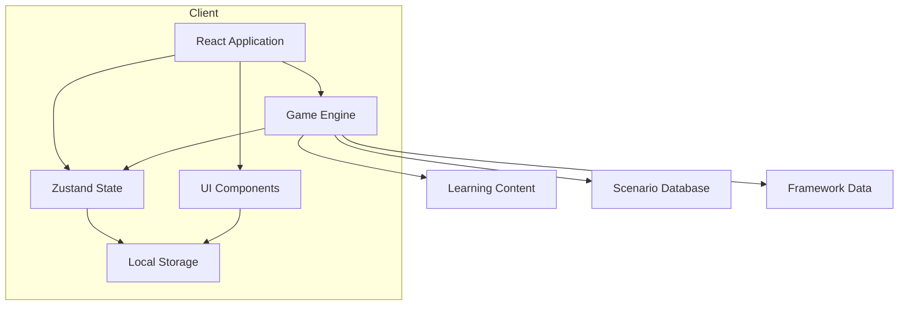
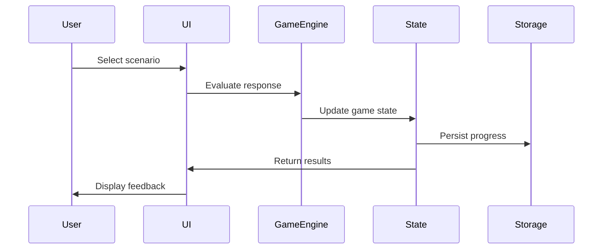

# System Architecture

Detailed system architecture documentation for the ARC, Tone Scale & EQ Learning Project.

---

## Overview

This document provides a comprehensive view of the system architecture, including component interactions, data flow, and technical decisions.

---

## Architecture Diagram



---

## Component Breakdown

### React Application

**Location:** `src/App.tsx`

**Responsibilities:**

- Route management
- Layout composition
- Global error handling
- Theme provider setup

### Zustand State Manager

**Location:** `src/store/`

**State Modules:**

- `gameState` - Current game progress
- `playerProgress` - Long-term progress tracking
- `settings` - User preferences
- `uiState` - UI-related state

### Game Engine

**Location:** `src/engine/`

**Responsibilities:**

- Scenario evaluation
- Tone calculation
- Score computation
- Progress tracking

### UI Components

**Location:** `src/components/`

**Key Components:**

- `ToneGauge` - Visual tone representation
- `ARCTriangle` - ARC triangle visualisation
- `ScenarioCard` - Scenario display
- `ScoreBoard` - Score display

---

## Data Flow

### User Interaction Flow



### Data Models

#### GameState

```typescript
interface GameState {
  currentScenario: string;
  currentTone: number;
  currentARC: {
    appreciation: number;
    reality: number;
    communication: number;
  };
  score: number;
  level: number;
}
```

#### PlayerProgress

```typescript
interface PlayerProgress {
  scenariosCompleted: string[];
  bestToneReached: number;
  eqComponents: {
    selfAwareness: number;
    selfRegulation: number;
    motivation: number;
    empathy: number;
    socialSkills: number;
  };
  lastPlayed: Date;
}
```

---

## Storage Strategy

### Local Storage

All data is stored in the browser's local storage:

```typescript
const STORAGE_KEYS = {
  GAME_STATE: "arc_learning_game_state",
  PLAYER_PROGRESS: "arc_learning_player_progress",
  SETTINGS: "arc_learning_settings",
};
```

### Data Persistence

- Automatic save on state changes
- No server required
- Cross-device sync not supported (local only)
- Export/import functionality available

---

## Technology Decisions

### Why React?

- Component-based architecture
- Strong ecosystem
- Excellent for interactive UIs
- Large community support

### Why TypeScript?

- Type safety reduces runtime errors
- Better IDE support
- Self-documenting code
- Easier refactoring

### Why Zustand?

- Minimal boilerplate
- Easy to use
- Built-in persistence support
- Small bundle size

### Why Tailwind CSS?

- Rapid development
- Consistent design
- Utility-first approach
- Easy theming

---

## Performance Considerations

### Optimisations

- Code splitting for large components
- Lazy loading of scenarios
- Memoisation of expensive calculations
- Debounced state updates

### Bundle Size Targets

- Initial load: < 200KB
- Total bundle: < 500KB
- Game engine: < 50KB

---

## Security Considerations

### Data Protection

- No sensitive data stored
- Local storage only
- No external API calls (unless configured)
- Input sanitisation for user inputs

### XSS Prevention

- React's built-in protection
- No dangerous HTML rendering
- Sanitised user inputs

---

## Future Architecture Considerations

### Potential Enhancements

1. **Backend Integration** - Add server for progress sync
2. **User Authentication** - Multi-device support
3. **Analytics** - Track learning progress
4. **Content Management** - Admin interface for scenarios

### Migration Path

Current architecture supports easy migration to:

- API-based backend
- Database persistence
- User accounts

---

_Last updated: 2026-02-25_
