# Phase 2 Test Fixes Plan

**Date:** 2026-02-25  
**Project:** ARC, Tone Scale & Emotional Intelligence Learning Project  
**Status:** 🚧 In Progress

---

## Executive Summary

Phase 2 testing revealed 45 failing tests (10% failure rate) across 5 test files. The issues stem from mismatches between documented implementations and actual source code, mock implementation issues, and naming convention inconsistencies.

### Test Coverage Summary

| Metric      | Value     |
| ----------- | --------- |
| Total Tests | 442       |
| Passing     | 397 (90%) |
| Failing     | 45 (10%)  |

### Failing Tests by File

| Test File                             | Tests | Failing | Primary Issue                                         |
| ------------------------------------- | ----- | ------- | ----------------------------------------------------- |
| `TESTS/utils/toneScale.test.ts`       | 60    | 7       | Source data mismatch (16 levels vs 15 documented)     |
| `TESTS/utils/arcCalculator.test.ts`   | 60    | 2       | Source logic mismatch (needsARCImprovement threshold) |
| `TESTS/hooks/useGame.test.ts`         | 39    | 19      | GameState enum mismatch (lowercase vs PascalCase)     |
| `TESTS/hooks/useToneScale.test.ts`    | 41    | 2       | Source data mismatch (Serenity description)           |
| `TESTS/hooks/useScore.test.ts`        | 72    | 39      | Source logic mismatch (bestScore calculation)         |
| `TESTS/hooks/useLocalStorage.test.ts` | 41    | 5       | Mock implementation (sync vs async expectations)      |

---

## Root Cause Analysis

### 1. GameState Enum Naming Convention

**Issue:** Tests expect PascalCase enum values (`NOT_STARTED`, `PLAYING`, `COMPLETED`), but actual implementation uses lowercase values (`notStarted`, `playing`, `completed`).

**Location:** `src/store/gameStore.ts` lines 16-20

```typescript
export enum GameState {
  NOT_STARTED = 'notStarted',
  PLAYING = 'playing',
  COMPLETED = 'completed',
}
```

**Impact:** 19 failing tests in `useGame.test.ts`

### 2. useScore bestScore Calculation Logic

**Issue:** The `addScore` action uses incorrect logic for updating best score.

**Current Implementation:**

```typescript
const newScore = score + points;
setScore(newScore);
setBestScore(Math.max(bestScore, newScore)); // This is correct
```

**Actual Problem:** The documentation states `Math.max(prev, prev + points)` which would be incorrect. Need to verify actual implementation.

**Impact:** 39 failing tests in `useScore.test.ts`

### 3. needsARCImprovement Threshold

**Issue:** Function returns `false` for `average = 5`, but documentation suggests it should return `true` for values below 5.

**Current Implementation:**

```typescript
export const needsARCImprovement = (arcState: ARCState): boolean => {
  return arcState.average < 5;
};
```

**Expected Behavior:** Should return `true` when average is less than 5, meaning `average = 5` should return `false` (no improvement needed).

**Impact:** 2 failing tests in `arcCalculator.test.ts`

### 4. Tone Scale Documentation Mismatch

**Issue:** Documentation states 15 levels, but actual implementation has 16 levels (includes Peace at 25).

**Actual Implementation:**

```typescript
export const TONE_SCALE: ToneLevel[] = [
  { value: -40, name: 'Total Failure', ... },
  // ... 14 more levels ...
  { value: 25, name: 'Peace', description: 'Calm and tranquility', ... },
  { value: 30, name: 'Ecstatic', ... },
  { value: 40, name: 'Serenity', ... },
];
```

**Impact:** 7 failing tests in `toneScale.test.ts`, 2 failing tests in `useToneScale.test.ts`

### 5. useLocalStorageArray Return Values

**Issue:** Array methods (`pop`, `shift`, `splice`) return values synchronously, but tests expect async behavior.

**Current Implementation:**

```typescript
pop: (): T | undefined => {
  let poppedItem: T | undefined;
  setArray(prev => {
    poppedItem = prev[prev.length - 1];
    return prev.slice(0, -1);
  });
  return poppedItem; // Returns synchronously
},
```

**Impact:** 5 failing tests in `useLocalStorage.test.ts`

---

## Fix Strategy

### Phase 1: Core Logic Fixes


### Phase 2: Documentation Updates


### Phase 3: Test Adjustments


---

## Detailed Fix Plan

### Fix 1: GameState Enum Naming Convention

**File:** `src/store/gameStore.ts`  
**Lines:** 16-20

**Current Code:**

```typescript
export enum GameState {
  NOT_STARTED = 'notStarted',
  PLAYING = 'playing',
  COMPLETED = 'completed',
}
```

**Proposed Change:** Keep as-is (lowercase values are valid TypeScript). Update tests to match actual implementation.

**Rationale:** The enum values are intentionally lowercase. Tests should be updated to reflect the actual implementation rather than changing the implementation to match incorrect test expectations.

### Fix 2: useScore bestScore Calculation

**File:** `src/hooks/useScore.ts`  
**Lines:** ~280-290

**Action:** Verify actual implementation matches documented behavior. If documentation is incorrect, update documentation.

**Expected Logic:**

```typescript
const addScore = useCallback(
  (points: number, isPositive: boolean) => {
    const newScore = score + points;
    setScore(newScore);
    setBestScore(Math.max(bestScore, newScore)); // Correct: compare newScore, not prev + points
    // ... rest of logic
  },
  [score, bestScore]
);
```

### Fix 3: needsARCImprovement Threshold

**File:** `src/utils/arcCalculator.ts`  
**Lines:** 330-332

**Current Code:**

```typescript
export const needsARCImprovement = (arcState: ARCState): boolean => {
  return arcState.average < 5;
};
```

**Analysis:** This is correct. `average = 5` should return `false` (no improvement needed). Tests expecting `true` for `average = 5` are incorrect.

**Action:** Update tests to match correct implementation.

### Fix 4: Tone Scale Documentation

**File:** `LEARN-DOCS/TONE-SCALE/full-scale.md` or similar  
**Action:** Update documentation to reflect 16 levels (not 15).

**Key Levels to Document:**

- Total Failure: -40
- Despair: -35
- Apathy: -30
- Gloom: -25
- Disinterest: -20
- Boredom: -15
- Pessimism: -10
- Scepticism: -5
- Neutrality: 0
- Optimism: 5
- Cheerful: 10
- Enthusiasm: 4
- Gay: 15
- Mastery: 20
- **Peace: 25** (often overlooked)
- Ecstatic: 30
- Serenity: 40

### Fix 5: useLocalStorageArray Test Expectations

**File:** `TESTS/hooks/useLocalStorage.test.ts`  
**Action:** Update tests to expect synchronous return values from array methods.

**Example Fix:**

```typescript
// Before (incorrect expectation)
const result = await pop(); // Expects async

// After (correct expectation)
const result = pop(); // Returns synchronously
expect(result).toBeDefined();
```

---

## Implementation Priority

| Priority | Fix                         | Files Affected                                                                                 | Tests Fixed |
| -------- | --------------------------- | ---------------------------------------------------------------------------------------------- | ----------- |
| **P1**   | GameState enum tests        | `TESTS/hooks/useGame.test.ts`                                                                  | 19 tests    |
| **P2**   | useScore logic verification | `src/hooks/useScore.ts`, `TESTS/hooks/useScore.test.ts`                                        | 39 tests    |
| **P3**   | needsARCImprovement tests   | `TESTS/utils/arcCalculator.test.ts`                                                            | 2 tests     |
| **P4**   | Tone Scale documentation    | `LEARN-DOCS/TONE-SCALE/*`, `TESTS/utils/toneScale.test.ts`, `TESTS/hooks/useToneScale.test.ts` | 9 tests     |
| **P5**   | useLocalStorageArray tests  | `TESTS/hooks/useLocalStorage.test.ts`                                                          | 5 tests     |

---

## Verification Plan

### Test Execution Flow

```mermaid
flowchart LR
    A[Run Full Test Suite] --> B{All Tests Pass?}
    B -->|Yes| C[✅ Complete]
    B -->|No| D[Identify Failing Tests]
    D --> E[Apply Fixes]
    E --> F[Re-run Specific Tests]
    F --> G{All Fixed?}
    G -->|Yes| A
    G -->|No| D

    style A fill:#fff3cd
    style C fill:#d4edda
    style B fill:#f8d7da
    style D fill:#cce5ff
    style E fill:#d1ecf1
    style F fill:#d4edda
    style G fill:#f8d7da
```



### Verification Checklist

- [ ] All 442 tests pass
- [ ] No TypeScript compilation errors
- [ ] No ESLint errors
- [ ] Documentation matches implementation
- [ ] Test coverage remains at 90%+

---

## Risk Assessment

| Risk                            | Likelihood | Impact | Mitigation                                 |
| ------------------------------- | ---------- | ------ | ------------------------------------------ |
| Breaking existing functionality | Low        | Medium | Run full test suite after each fix         |
| Documentation drift             | Medium     | Low    | Update docs immediately after code changes |
| Test flakiness                  | Low        | Low    | Use deterministic test data                |
| Scope creep                     | Medium     | Medium | Stick to documented fixes only             |

---

## Success Criteria

1. **All tests pass:** 442/442 tests passing (100%)
2. **Documentation accuracy:** All docs match actual implementation
3. **No regressions:** Existing functionality unchanged
4. **Code quality:** No new ESLint or TypeScript errors

---

## Next Steps

1. **Review this plan** with stakeholder approval
2. **Switch to Code mode** for implementation
3. **Apply fixes** in priority order (P1 → P5)
4. **Verify each fix** before proceeding to next
5. **Update documentation** to reflect changes
6. **Final verification** with full test suite

---

## Appendix: Test Failure Details

### useGame.test.ts Failures (19 tests)

**Root Cause:** GameState enum value mismatch

**Example Failing Test:**

```typescript
// Test expects
expect(gameState.gameState).toBe(GameState.NOT_STARTED);

// Actual value is 'notStarted' (lowercase string)
```

### useScore.test.ts Failures (39 tests)

**Root Cause:** bestScore calculation logic mismatch

**Example Failing Test:**

```typescript
// Test expects bestScore to update incorrectly
// Actual implementation may be correct
```

### arcCalculator.test.ts Failures (2 tests)

**Root Cause:** needsARCImprovement threshold expectation

**Example Failing Test:**

```typescript
// Test expects needsARCImprovement({ average: 5 }) to return true
// Actual implementation returns false (correct behavior)
```

### toneScale.test.ts Failures (7 tests)

**Root Cause:** Documentation states 15 levels, actual has 16

**Example Failing Test:**

```typescript
// Test expects TONE_SCALE.length === 15
// Actual length is 16 (includes Peace at 25)
```

### useToneScale.test.ts Failures (2 tests)

**Root Cause:** Serenity description mismatch

**Example Failing Test:**

```typescript
// Test expects Serenity description to contain 'Serenity'
// Actual description is 'Perfect peace and beingness'
```

### useLocalStorage.test.ts Failures (5 tests)

**Root Cause:** Async vs sync return value expectations

**Example Failing Test:**

```typescript
// Test expects async behavior
const result = await hook.pop();

// Actual implementation returns synchronously
const result = hook.pop();
```

---

_Last updated: 2026-02-25_
