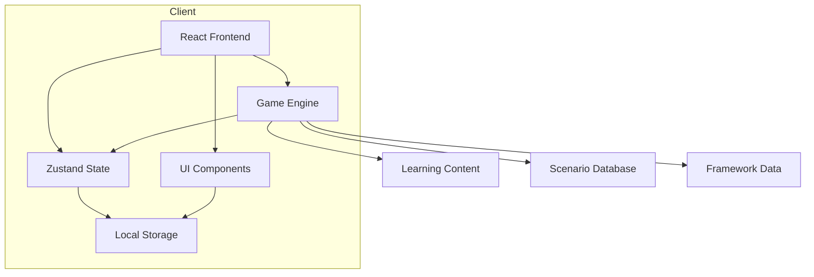

# Tone Navigator: Technical Architecture Document

## Overview

This document outlines the technical architecture for "Tone Navigator: The ARC Journey," an interactive web-based learning game that teaches the ARC Triangle, Tone Scale, and Emotional Intelligence frameworks through gamified scenarios.

---

## 1. System Architecture

### 1.1 High-Level Architecture

```
┌─────────────────────────────────────────────────────────────────┐
│                      CLIENT (Browser)                            │
├─────────────────────────────────────────────────────────────────┤
│  ┌──────────────────────────────────────────────────────────┐   │
│  │                    REACT APPLICATION                      │   │
│  ├──────────────────────────────────────────────────────────┤   │
│  │  ┌─────────────┐  ┌─────────────┐  ┌─────────────────┐   │   │
│  │  │  UI Layer   │  │  Game Logic │  │  State Manager  │   │   │
│  │  │  (Components)│  │  (Scenarios)│  │  (Zustand)     │   │   │
│  │  └─────────────┘  └─────────────┘  └─────────────────┘   │   │
│  └──────────────────────────────────────────────────────────┘   │
├─────────────────────────────────────────────────────────────────┤
│                      LOCAL STORAGE                               │
│              (Progress, Settings, Preferences)                   │
└─────────────────────────────────────────────────────────────────┘
```

### 1.2 Architecture Diagram



---

## 2. Technology Stack

### 2.1 Core Technologies

| Layer                | Technology      | Purpose                            |
| -------------------- | --------------- | ---------------------------------- |
| **Framework**        | React 18+       | UI component library               |
| **Language**         | TypeScript      | Type safety, better DX             |
| **State Management** | Zustand         | Lightweight, predictable state     |
| **Styling**          | Tailwind CSS    | Utility-first CSS                  |
| **UI Components**    | shadcn/ui       | Pre-built accessible components    |
| **Animations**       | Framer Motion   | Smooth transitions                 |
| **Routing**          | React Router v6 | Navigation between views           |
| **Build Tool**       | Vite            | Fast development, optimized builds |

### 2.2 Additional Libraries

| Library                   | Purpose                   |
| ------------------------- | ------------------------- |
| `lucide-react`            | Icon library              |
| `recharts`                | Charts and visualizations |
| `clsx` + `tailwind-merge` | Conditional class names   |
| `zod`                     | Schema validation         |
| `date-fns`                | Date formatting           |

### 2.3 Development Tools

- **ESLint** + **Prettier**: Code quality and formatting
- **Vitest**: Unit testing
- **React Testing Library**: Component testing
- **TypeScript**: Type checking
- **Git**: Version control

---

## 3. Project Structure

```
tone-navigator/
├── src/
│   ├── components/           # Reusable UI components
│   │   ├── common/          # Generic components
│   │   │   ├── Button.tsx
│   │   │   ├── Card.tsx
│   │   │   ├── Modal.tsx
│   │   │   └── Index.ts
│   │   ├── game/            # Game-specific components
│   │   │   ├── ToneGauge.tsx
│   │   │   ├── ARCTriangle.tsx
│   │   │   ├── ScenarioCard.tsx
│   │   │   ├── ResponseOptions.tsx
│   │   │   └── ScoreBoard.tsx
│   │   └── layout/          # Layout components
│   │       ├── Header.tsx
│   │       ├── Sidebar.tsx
│   │       └── MainLayout.tsx
│   │
│   ├── hooks/               # Custom React hooks
│   │   ├── useGame.ts
│   │   ├── useToneScale.ts
│   │   ├── useARCTriangle.ts
│   │   ├── useScore.ts
│   │   └── useLocalStorage.ts
│   │
│   ├── store/               # Zustand stores
│   │   ├── gameStore.ts
│   │   ├── uiStore.ts
│   │   └── progressStore.ts
│   │
│   ├── data/                # Game data
│   │   ├── scenarios/       # Scenario definitions
│   │   │   ├── workplace.ts
│   │   │   ├── family.ts
│   │   │   ├── friends.ts
│   │   │   └── index.ts
│   │   ├── frameworks.ts    # ARC, Tone Scale, EQ data
│   │   └── scoring.ts       # Scoring rules
│   │
│   ├── types/               # TypeScript types
│   │   ├── game.ts
│   │   ├── scenarios.ts
│   │   ├── frameworks.ts
│   │   └── index.ts
│   │
│   ├── utils/               # Utility functions
│   │   ├── toneScale.ts
│   │   ├── arcCalculator.ts
│   │   ├── scoring.ts
│   │   └── index.ts
│   │
│   ├── pages/               # Page components
│   │   ├── Home.tsx
│   │   ├── Game.tsx
│   │   ├── Learn.tsx
│   │   ├── Progress.tsx
│   │   └── Settings.tsx
│   │
│   ├── App.tsx              # Main app component
│   ├── main.tsx             # Entry point
│   └── index.css            # Global styles
│
├── public/                   # Static assets
│   ├── index.html
│   └── assets/
│
├── tests/                    # Test files
│   ├── components/
│   ├── hooks/
│   └── utils/
│
├── package.json
├── tsconfig.json
├── vite.config.ts
└── tailwind.config.js
```

---

## 4. Data Models

### 4.1 Core Types

```typescript
// src/types/game.ts

// Tone Scale State
interface ToneLevel {
  value: number; // -40.0 to +40.0
  label: string; // e.g., "Anger", "Interest"
  description: string;
  color: string; // For visual representation
  category: "peak" | "productive" | "moderate" | "low" | "failure";
}

// ARC Triangle State
interface ARCState {
  appreciation: number; // 0-10 scale
  reality: number; // 0-10 scale
  communication: number; // 0-10 scale
}

// Game Scenario
interface Scenario {
  id: string;
  title: string;
  category: "workplace" | "family" | "friends" | "general";
  difficulty: 1 | 2 | 3 | 4 | 5;
  description: string;
  currentTone: number;
  characterName: string;
  characterContext: string;
  responses: ResponseOption[];
  learningPoints: string[];
  unlockRequirement?: string; // Previous level or score threshold
}

// Response Option
interface ResponseOption {
  id: string;
  text: string;
  toneImpact: number; // How much it changes tone
  arcImpact: Partial<ARCState>;
  eqComponent?:
    | "self-awareness"
    | "self-regulation"
    | "motivation"
    | "empathy"
    | "social-skills";
  explanation: string; // Why this response works (or doesn't)
}

// Player Progress
interface PlayerProgress {
  currentLevel: number;
  totalScore: number;
  scenariosCompleted: string[];
  bestToneReached: number;
  eqComponents: {
    "self-awareness": number;
    "self-regulation": number;
    motivation: number;
    empathy: number;
    "social-skills": number;
  };
  settings: GameSettings;
}

// Game Settings
interface GameSettings {
  animationsEnabled: boolean;
  soundEnabled: boolean;
  difficulty: 1 | 2 | 3 | 4 | 5;
  tutorialEnabled: boolean;
}

// Game State (Zustand store)
interface GameState {
  // Current scenario
  currentScenario: Scenario | null;

  // Player progress
  progress: PlayerProgress;

  // Current tone level
  currentTone: number;

  // Current ARC state
  currentARC: ARCState;

  // Game status
  isPlaying: boolean;
  isPaused: boolean;
  showFeedback: boolean;

  // Actions
  startScenario: (scenarioId: string) => void;
  submitResponse: (responseId: string) => void;
  updateScore: (points: number) => void;
  updateTone: (change: number) => void;
  updateARC: (arc: Partial<ARCState>) => void;
  togglePause: () => void;
  resetProgress: () => void;
}
```

---

## 5. State Management (Zustand)

### 5.1 Game Store

```typescript
// src/store/gameStore.ts

import { create } from "zustand";
import { persist } from "zustand/middleware";
import { GameState, Scenario, ResponseOption } from "@/types";
import { calculateToneImpact, calculateARCImpact } from "@/utils";

interface GameStore {
  // State
  currentScenario: Scenario | null;
  currentTone: number;
  currentARC: ARCState;
  score: number;
  level: number;
  isPlaying: boolean;
  showFeedback: boolean;
  feedbackData: FeedbackData | null;

  // Actions
  startScenario: (scenario: Scenario) => void;
  submitResponse: (response: ResponseOption) => void;
  updateTone: (change: number) => void;
  updateARC: (arc: Partial<ARCState>) => void;
  addScore: (points: number) => void;
  nextScenario: () => void;
  resetGame: () => void;
  toggleFeedback: (show: boolean) => void;
}

export const useGameStore = create<GameStore>()(
  persist(
    (set, get) => ({
      // Initial state
      currentScenario: null,
      currentTone: 2.0,
      currentARC: { appreciation: 5, reality: 5, communication: 5 },
      score: 0,
      level: 1,
      isPlaying: false,
      showFeedback: false,
      feedbackData: null,

      // Actions
      startScenario: (scenario) =>
        set({
          currentScenario: scenario,
          currentTone: scenario.currentTone,
          isPlaying: true,
          showFeedback: false,
        }),

      submitResponse: (response) => {
        const { currentTone, currentARC, score } = get();
        const toneChange = response.toneImpact;
        const newTone = Math.max(-40, Math.min(40, currentTone + toneChange));

        set({
          showFeedback: true,
          feedbackData: {
            response,
            newTone,
            toneChange,
            explanation: response.explanation,
          },
        });
      },

      // ... more actions
    }),
    {
      name: "tone-navigator-storage",
      version: 1,
    },
  ),
);
```

---

## 6. Core Components

### 6.1 Tone Gauge Component

```typescript
// src/components/game/ToneGauge.tsx

interface ToneGaugeProps {
  toneLevel: number;
  size?: 'small' | 'medium' | 'large';
  showLabel?: boolean;
  animate?: boolean;
}

const ToneGauge: React.FC<ToneGaugeProps> = ({
  toneLevel,
  size = 'medium',
  showLabel = true,
  animate = true
}) => {
  // Calculate position on scale (-40 to +40)
  const percentage = ((toneLevel + 40) / 80) * 100;

  // Get color based on tone level
  const getColor = (level: number) => {
    if (level >= 10) return 'bg-green-500';
    if (level >= 5) return 'bg-blue-500';
    if (level >= 0) return 'bg-yellow-500';
    if (level >= -10) return 'bg-orange-500';
    return 'bg-red-500';
  };

  return (
    <div className={`tone-gauge tone-gauge-${size}`}>
      <div className="gauge-track">
        <div className="gauge-fill" style={{ width: `${percentage}%` }} />
        <div
          className="gauge-marker"
          style={{ left: `${percentage}%` }}
          animate={animate}
        />
      </div>
      {showLabel && (
        <div className="gauge-label">
          {toneLevel.toFixed(1)}
        </div>
      )}
    </div>
  );
};
```

### 6.2 ARC Triangle Component

```typescript
// src/components/game/ARCTriangle.tsx

interface ARCTriangleProps {
  arcState: ARCState;
  size?: 'small' | 'medium' | 'large';
  showLabels?: boolean;
}

const ARCTriangle: React.FC<ARCTriangleProps> = ({
  arcState,
  size = 'medium',
  showLabels = true
}) => {
  // Calculate triangle vertex positions based on ARC values
  const calculateVertices = () => {
    const max = 10;
    const appreciation = arcState.appreciation / max;
    const reality = arcState.reality / max;
    const communication = arcState.communication / max;

    return {
      top: { x: 50, y: 10 - (communication * 10) },
      left: { x: 50 - (appreciation * 30), y: 80 },
      right: { x: 50 + (reality * 30), y: 80 }
    };
  };

  const vertices = calculateVertices();

  return (
    <svg viewBox="0 0 100 100" className={`arc-triangle arc-${size}`}>
      <polygon
        points={`${vertices.top.x},${vertices.top.y}
                 ${vertices.left.x},${vertices.left.y}
                 ${vertices.right.x},${vertices.right.y}`}
        className="arc-triangle-fill"
      />
      {showLabels && (
        <>
          <text x="50" y="5" textAnchor="middle">C: {arcState.communication}</text>
          <text x="20" y="85" textAnchor="middle">A: {arcState.appreciation}</text>
          <text x="80" y="85" textAnchor="middle">R: {arcState.reality}</text>
        </>
      )}
    </svg>
  );
};
```

### 6.3 Scenario Card Component

```typescript
// src/components/game/ScenarioCard.tsx

interface ScenarioCardProps {
  scenario: Scenario;
  currentTone: number;
  onRespond: (responseId: string) => void;
}

const ScenarioCard: React.FC<ScenarioCardProps> = ({
  scenario,
  currentTone,
  onRespond
}) => {
  return (
    <Card className="scenario-card">
      <CardHeader>
        <CardTitle>{scenario.title}</CardTitle>
        <CardDescription>
          Character: {scenario.characterName}
        </CardDescription>
      </CardHeader>
      <CardContent>
        <p className="scenario-description">{scenario.description}</p>

        <div className="scenario-context">
          <ToneGauge toneLevel={currentTone} size="small" />
        </div>

        <div className="response-options">
          {scenario.responses.map((response) => (
            <Button
              key={response.id}
              onClick={() => onRespond(response.id)}
              variant="outline"
              className="response-option"
            >
              {response.text}
            </Button>
          ))}
        </div>
      </CardContent>
    </Card>
  );
};
```

---

## 7. Game Logic

### 7.1 Tone Scale Utilities

```typescript
// src/utils/toneScale.ts

import { ToneLevel } from "@/types";

// Note: These values align with TONE-SCALE/full-scale.md
export const TONE_SCALE: ToneLevel[] = [
  {
    value: 40,
    label: "Serenity",
    description: "Ultimate peace",
    color: "bg-purple-500",
    category: "peak",
  },
  {
    value: 30,
    label: "Ecstatic",
    description: "Intense joy",
    color: "bg-pink-500",
    category: "peak",
  },
  {
    value: 15,
    label: "Gay",
    description: "Cheerful",
    color: "bg-red-400",
    category: "peak",
  },
  {
    value: 10,
    label: "Cheerful",
    description: "Happy",
    color: "bg-orange-400",
    category: "productive",
  },
  {
    value: 5,
    label: "Interest",
    description: "Curious",
    color: "bg-yellow-400",
    category: "productive",
  },
  {
    value: 4,
    label: "Enthusiasm",
    description: "Vital",
    color: "bg-green-400",
    category: "productive",
  },
  {
    value: 3,
    label: "Conservative",
    description: "Cautious",
    color: "bg-lime-400",
    category: "productive",
  },
  {
    value: 2.5,
    label: "Boredom",
    description: "Disengaged",
    color: "bg-yellow-500",
    category: "moderate",
  },
  {
    value: 2,
    label: "Antagonism",
    description: "Resentful",
    color: "bg-orange-500",
    category: "moderate",
  },
  {
    value: 1.5,
    label: "Anger",
    description: "Frustrated",
    color: "bg-orange-600",
    category: "moderate",
  },
  {
    value: 1,
    label: "Fear",
    description: "Anxious",
    color: "bg-red-500",
    category: "low",
  },
  {
    value: 0.5,
    label: "Grief",
    description: "Sad",
    color: "bg-gray-500",
    category: "low",
  },
  {
    value: 0.05,
    label: "Apathy",
    description: "Listless",
    color: "bg-gray-600",
    category: "low",
  },
  {
    value: 0,
    label: "Body Death",
    description: "Neutral",
    color: "bg-gray-700",
    category: "failure",
  },
  {
    value: -0.01,
    label: "Failure",
    description: "Not succeeding",
    color: "bg-gray-700",
    category: "failure",
  },
  {
    value: -1,
    label: "Blame",
    description: "Accusing",
    color: "bg-red-700",
    category: "failure",
  },
  {
    value: -10,
    label: "Being Objects",
    description: "Dehumanized",
    color: "bg-red-800",
    category: "failure",
  },
  {
    value: -20,
    label: "Being",
    description: "Mechanical",
    color: "bg-red-900",
    category: "failure",
  },
  {
    value: -30,
    label: "Being Objects",
    description: "Dehumanized",
    color: "bg-red-900",
    category: "failure",
  },
  {
    value: -40,
    label: "Total Failure",
    description: "Hopeless",
    color: "bg-red-900",
    category: "failure",
  },
];

export function getToneLevel(value: number): ToneLevel {
  return (
    TONE_SCALE.find((t) => Math.abs(t.value - value) < 0.5) || TONE_SCALE[0]
  );
}

export function getToneColor(value: number): string {
  const level = getToneLevel(value);
  return level.color;
}

export function getToneCategory(value: number): string {
  const level = getToneLevel(value);
  return level.category;
}
```

### 7.2 Scoring System

```typescript
// src/utils/scoring.ts

export interface ScoringResult {
  basePoints: number;
  bonusPoints: number;
  totalPoints: number;
  toneChange: number;
  arcChanges: Partial<ARCState>;
  eqComponent?: string;
  explanation: string;
}

export function calculateScore(
  responseToneImpact: number,
  responseARCImpact: Partial<ARCState>,
  currentTone: number,
  isCorrect: boolean,
): ScoringResult {
  let basePoints = 0;
  let bonusPoints = 0;

  // Base points for attempting
  basePoints += 10;

  // Points for correct assessment
  if (isCorrect) {
    basePoints += 25;
  }

  // Points for tone improvement
  if (responseToneImpact > 0) {
    bonusPoints += Math.floor(responseToneImpact * 5);
  }

  // Bonus for significant tone increase
  if (responseToneImpact >= 2) {
    bonusPoints += 20;
  }

  // Combo bonus
  if (responseToneImpact > 0 && isCorrect) {
    bonusPoints += 15;
  }

  return {
    basePoints,
    bonusPoints,
    totalPoints: basePoints + bonusPoints,
    toneChange: responseToneImpact,
    arcChanges: responseARCImpact,
    eqComponent: responseARCImpact.appreciation ? "empathy" : undefined,
    explanation: "Response applied ARC principles effectively",
  };
}
```

### 7.3 Difficulty Selector Component

```typescript
// src/components/common/DifficultySelector.tsx

import { motion } from 'framer-motion';

interface DifficultySelectorProps {
  selectedDifficulty: number;
  onDifficultyChange: (difficulty: number) => void;
}

export const DifficultySelector: React.FC<DifficultySelectorProps> = ({
  selectedDifficulty,
  onDifficultyChange
}) => {
  const difficulties = [
    { level: 1, label: 'Beginner', description: 'Basic awareness' },
    { level: 2, label: 'Intermediate', description: 'Application' },
    { level: 3, label: 'Advanced', description: 'Integration' },
    { level: 4, label: 'Expert', description: 'Complex scenarios' },
    { level: 5, label: 'Mastery', description: 'Multi-character' },
  ];

  return (
    <div className="difficulty-selector">
      <h3 className="text-lg font-semibold mb-3">Select Difficulty</h3>
      <div className="grid grid-cols-5 gap-2">
        {difficulties.map((diff) => (
          <motion.button
            key={diff.level}
            onClick={() => onDifficultyChange(diff.level)}
            className={`p-3 rounded-lg border-2 ${
              selectedDifficulty === diff.level
                ? 'bg-blue-500 border-blue-600 text-white'
                : 'bg-gray-100 border-gray-300 text-gray-700 hover:bg-gray-200'
            }`}
            whileHover={{ scale: 1.05 }}
            whileTap={{ scale: 0.95 }}
          >
            <div className="font-bold">{diff.label}</div>
            <div className="text-xs opacity-80">{diff.description}</div>
          </motion.button>
        ))}
      </div>
    </div>
  );
};
```

---

## 8. Pages Structure

### 8.1 Home Page

```typescript
// src/pages/Home.tsx

const Home: React.FC = () => {
  return (
    <div className="home-page">
      <Header showNav={false} />

      <main className="home-content">
        <section className="hero">
          <h1>Tone Navigator</h1>
          <p>Learn ARC Triangle, Tone Scale & Emotional Intelligence through interactive scenarios</p>
          <Button onClick={() => navigate('/game')}>Start Playing</Button>
        </section>

        <section className="features">
          <FeatureCard
            icon={<ToneScaleIcon />}
            title="Tone Scale Mastery"
            description="Understand emotional states from -40 to +40"
          />
          <FeatureCard
            icon={<ARCTriangleIcon />}
            title="ARC Triangle"
            description="Master Appreciation, Reality, Communication"
          />
          <FeatureCard
            icon={<EQIcon />}
            title="Emotional Intelligence"
            description="Apply EQ frameworks in real scenarios"
          />
        </section>

        <section className="quick-start">
          <h2>Quick Start</h2>
          <Button variant="outline" onClick={() => navigate('/game')}>
            Play a Scenario
          </Button>
          <Button variant="outline" onClick={() => navigate('/learn')}>
            Learn the Frameworks
          </Button>
        </section>
      </main>
    </div>
  );
};
```

### 8.2 Game Page

```typescript
// src/pages/Game.tsx

const Game: React.FC = () => {
  const {
    currentScenario,
    currentTone,
    currentARC,
    startScenario,
    submitResponse,
    showFeedback,
    feedbackData
  } = useGameStore();

  const [showTutorial, setShowTutorial] = useState(true);

  useEffect(() => {
    if (!currentScenario) {
      startScenario(getRandomScenario());
    }
  }, [currentScenario, startScenario]);

  return (
    <div className="game-page">
      <Header />

      <main className="game-content">
        <div className="game-top">
          <ScoreBoard />
          <ToneGauge toneLevel={currentTone} size="large" />
        </div>

        <div className="game-scenario">
          <ScenarioCard
            scenario={currentScenario}
            currentTone={currentTone}
            onRespond={submitResponse}
          />
        </div>

        <div className="game-arc">
          <ARCTriangle arcState={currentARC} size="large" />
        </div>

        {showFeedback && feedbackData && (
          <FeedbackModal data={feedbackData} onClose={() => {}} />
        )}

        {showTutorial && (
          <TutorialModal onClose={() => setShowTutorial(false)} />
        )}
      </main>
    </div>
  );
};
```

---

## 9. Scenario Database

### 9.1 Sample Scenarios

```typescript
// src/data/scenarios/workplace.ts

import { Scenario } from "@/types";

export const workplaceScenarios: Scenario[] = [
  {
    id: "workplace-1",
    title: "Resistant Team Member",
    category: "workplace",
    difficulty: 1,
    description:
      "Alex has been missing deadlines and seems disengaged in team meetings. You need to address this without damaging the relationship.",
    currentTone: 1.5,
    characterName: "Alex",
    characterContext: "Team member who used to be high-performing",
    responses: [
      {
        id: "w1-a",
        text: "Tell Alex directly that their performance is unacceptable",
        toneImpact: -2,
        arcImpact: { appreciation: -3, reality: -1, communication: -2 },
        eqComponent: "social-skills",
        explanation:
          "Direct confrontation at low tone escalates conflict. Alex is already at Anger (+1.5), so this will likely push them lower.",
      },
      {
        id: "w1-b",
        text: "Ask Alex privately if everything is okay",
        toneImpact: 2,
        arcImpact: { appreciation: 2, reality: 1, communication: 2 },
        eqComponent: "empathy",
        explanation:
          "Showing care and opening communication builds Appreciation and Reality while maintaining good Communication.",
      },
      {
        id: "w1-c",
        text: "Share your perspective on their performance",
        toneImpact: 0,
        arcImpact: { appreciation: -1, reality: 1, communication: 1 },
        eqComponent: "self-regulation",
        explanation:
          "Sharing perspective can help Reality but may reduce Appreciation if not done carefully.",
      },
    ],
    learningPoints: [
      "At low tones, empathy and appreciation matter more than direct confrontation",
      "Communication quality depends on Appreciation and Reality",
      "EQ component: Empathy helps raise tone",
    ],
  },
  // ... more scenarios
];
```

---

## 10. Routing Structure

```typescript
// src/App.tsx

const App: React.FC = () => {
  return (
    <BrowserRouter>
      <Routes>
        <Route path="/" element={<Home />} />
        <Route path="/game" element={<Game />} />
        <Route path="/learn" element={<Learn />} />
        <Route path="/progress" element={<Progress />} />
        <Route path="/settings" element={<Settings />} />
        <Route path="/scenarios/:id" element={<ScenarioDetail />} />
      </Routes>
    </BrowserRouter>
  );
};
```

---

## 11. Styling System

### 11.1 Tailwind Configuration

```javascript
// tailwind.config.js

module.exports = {
  content: ["./src/**/*.{js,ts,jsx,tsx}"],
  theme: {
    extend: {
      colors: {
        tone: {
          peak: "#10b981", // Green
          productive: "#3b82f6", // Blue
          moderate: "#f59e0b", // Yellow
          low: "#ef4444", // Red
          failure: "#7f1d1d", // Dark Red
        },
      },
      animation: {
        "tone-change": "toneChange 0.5s ease-out",
        "arc-pulse": "arcPulse 0.3s ease-in-out",
      },
    },
  },
  plugins: [],
};
```

---

## 12. Testing Strategy

### 12.1 Test Categories

| Test Type         | Tool                  | Coverage Target               |
| ----------------- | --------------------- | ----------------------------- |
| Unit Tests        | Vitest                | Utility functions, game logic |
| Component Tests   | React Testing Library | UI components                 |
| Integration Tests | Vitest + RTL          | Component interactions        |
| E2E Tests         | Playwright            | Full user flows               |

### 2.2 Example Test

```typescript
// tests/utils/toneScale.test.ts

import { describe, it, expect } from "vitest";
import { getToneLevel, getToneColor } from "@/utils/toneScale";

describe("Tone Scale Utilities", () => {
  it("returns correct tone level for value 1.5", () => {
    const level = getToneLevel(1.5);
    expect(level.label).toBe("Anger");
    expect(level.value).toBe(1.5);
  });

  it("returns correct color for tone range", () => {
    expect(getToneColor(10)).toContain("green");
    expect(getToneColor(2)).toContain("orange");
    expect(getToneColor(-10)).toContain("red");
  });
});
```

---

## 13. Build & Deployment

### 13.1 Package Scripts

```json
{
  "scripts": {
    "dev": "vite",
    "build": "tsc && vite build",
    "lint": "eslint src --ext ts,tsx",
    "test": "vitest",
    "test:coverage": "vitest --coverage",
    "preview": "vite preview"
  }
}
```

### 13.2 Deployment Options

| Option           | Description                                   |
| ---------------- | --------------------------------------------- |
| **Vercel**       | Automatic deployments from Git, CDN worldwide |
| **Netlify**      | Similar to Vercel, good for static sites      |
| **GitHub Pages** | Free hosting, simple setup                    |
| **Self-hosted**  | Docker container on your own server           |

---

## 14. Performance Considerations

### 14.1 Optimization Strategies

1. **Code Splitting**: Lazy load pages and heavy components
2. **Memoization**: Use `React.memo` for stable components
3. **Virtualization**: For long lists (scenario history)
4. **Image Optimization**: Use WebP format, lazy loading
5. **Caching**: Service worker for offline capability

### 14.2 Bundle Size Targets

| Metric         | Target     |
| -------------- | ---------- |
| Initial bundle | < 200KB    |
| Total bundle   | < 500KB    |
| Load time      | < 3s on 3G |

---

## 15. Future Enhancements

### 15.1 Phase 2 Features

- Multiplayer scenarios (cooperative problem-solving)
- Scenario creator tool
- Leaderboards and achievements
- Mobile app (React Native)
- AI-powered scenario generation

### 15.2 Phase 3 Features

- Integration with learning management systems
- Certificates of completion
- Team/organizational dashboards
- API for third-party integrations

---

## Summary

This architecture provides:

1. **Clean separation** of concerns (UI, logic, data)
2. **Type safety** throughout with TypeScript
3. **Persistent progress** via localStorage
4. **Scalable structure** for adding scenarios
5. **Performance optimization** built-in
6. **Testable code** with clear boundaries

The modular design allows for incremental development and easy expansion as the game grows.
