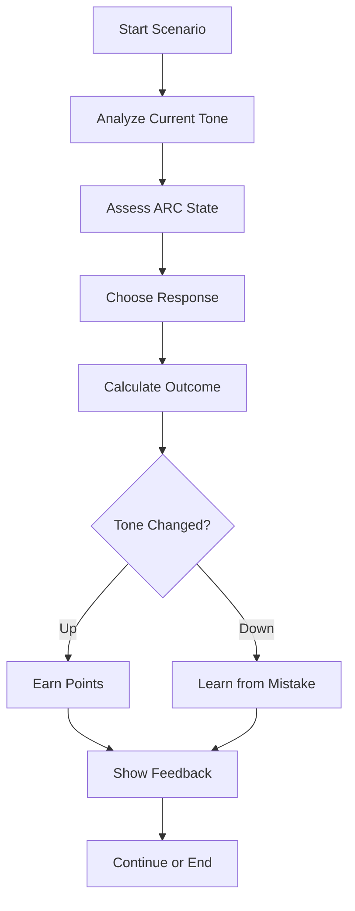

# Tone Navigator: Project Summary

This document provides a comprehensive overview of the Tone Navigator project, consolidating all architectural decisions, design specifications, and implementation plans.

---

## Project Overview

**Tone Navigator: The ARC Journey** is an interactive web-based learning game that teaches three interconnected frameworks:

1. **ARC Triangle** - Appreciation, Reality, Communication
2. **Tone Scale** - Emotional gradient from -40.0 to +40.0
3. **Emotional Intelligence** - Goleman, Six Seconds, and ARC Trauma models

The game uses gamification to help players apply these frameworks in realistic social scenarios, earning points and progressing through levels as they learn to help characters reach higher emotional states.

---

## Document Index

| Document               | Path                                                                 | Purpose                                              |
| ---------------------- | -------------------------------------------------------------------- | ---------------------------------------------------- |
| Technical Architecture | [`tone-navigator-architecture.md`](./tone-navigator-architecture.md) | System design, data models, state management         |
| Scenario Database      | [`tone-navigator-scenarios.md`](./tone-navigator-scenarios.md)       | 9 detailed scenarios with responses and scoring      |
| UI/UX Design           | [`tone-navigator-ui-ux.md`](./tone-navigator-ui-ux.md)               | Component specs, visual design, interaction patterns |
| **This Summary**       | [`tone-navigator-summary.md`](./tone-navigator-summary.md)           | Project overview and next steps                      |

---

## Key Technical Decisions

### Frontend Stack

| Technology        | Reason                                         |
| ----------------- | ---------------------------------------------- |
| **React 18+**     | Component-based architecture, strong ecosystem |
| **TypeScript**    | Type safety, better developer experience       |
| **Zustand**       | Lightweight state management, easy persistence |
| **Tailwind CSS**  | Utility-first styling, rapid development       |
| **shadcn/ui**     | Accessible, customizable components            |
| **Framer Motion** | Smooth animations for engaging UX              |
| **Vite**          | Fast development, optimized builds             |

### Data Architecture

```
┌─────────────────────────────────────────────────────────┐
│                    LOCAL STORAGE                         │
├─────────────────────────────────────────────────────────┤
│  game-state: {                                           │
│    currentScenario,                                      │
│    currentTone,                                          │
│    currentARC,                                           │
│    score,                                                │
│    level                                                 │
│  }                                                       │
│  player-progress: {                                      │
│    scenariosCompleted,                                   │
│    bestToneReached,                                      │
│    eqComponents                                          │
│  }                                                       │
└─────────────────────────────────────────────────────────┘
```

### Component Hierarchy

```
App
├── Layout (Header, Sidebar)
├── Pages
│   ├── Home
│   ├── Game
│   ├── Learn
│   ├── Progress
│   └── Settings
└── Components
    ├── ToneGauge
    ├── ARCTriangle
    ├── ScenarioCard
    ├── ScoreBoard
    ├── FeedbackModal
    └── TutorialModal
```

---

## Core Game Mechanics

### Gameplay Loop



### Scoring System

| Action                        | Points       |
| ----------------------------- | ------------ |
| Attempt response              | +10          |
| Correct assessment            | +25          |
| Tone improvement (+1)         | +5 per point |
| Significant improvement (+2+) | +20 bonus    |
| Combo (correct + improvement) | +15 bonus    |

### Progression System

| Level | Description                | Tone Range     |
| ----- | -------------------------- | -------------- |
| 1     | Beginner - Basic awareness | +2.0 to +10.0  |
| 2     | Intermediate - Application | -1.0 to +5.0   |
| 3     | Advanced - Integration     | -10.0 to +2.0  |
| 4     | Expert - Complex scenarios | -20.0 to +1.0  |
| 5     | Mastery - Multi-character  | -40.0 to +40.0 |

---

## Scenario Categories

### Workplace (3 scenarios)

- Resistant Team Member
- Difficult Client Call
- Team Conflict During Meeting

### Family (2 scenarios)

- Teenage Child's Poor Grades
- Elderly Parent's Resistance to Help

### Friends (2 scenarios)

- Friend's Bad Life Decision
- Friend Group Conflict

### General (2 scenarios)

- Stranger in Distress
- Colleague's Personal Crisis

### Future Expansion Categories

- **Leadership** - Managing teams, making decisions
- **Romantic Relationships** - Partner interactions
- **Parenting** - Raising children
- **Educational** - Teacher-student interactions
- **Healthcare** - Patient-provider interactions

---

## Visual Design System

### Color Palette

```
Primary: #3b82f6 (Blue)
Secondary: #8b5cf6 (Purple)
Success: #10b981 (Green)
Warning: #f59e0b (Yellow)
Error: #ef4444 (Red)

Tone Scale:
Peak (+10 to +40): Green → Purple
Productive (+3 to +9): Blue → Green
Moderate (0 to +2.9): Yellow → Blue
Low (-0.01 to -9): Red → Orange
Failure (-10 to -40): Dark Red
```

### Typography

```
Font: Inter (Google Fonts)
Headings: 700 (Bold)
Body: 400 (Regular)
Small: 300 (Light)

Sizes: H1(36px), H2(30px), H3(24px), Body(16px), Small(14px), XS(12px)
```

---

## Implementation Roadmap

### Phase 1: Foundation (Week 1)

- [ ] Set up React + TypeScript + Vite project
- [ ] Configure Tailwind CSS and shadcn/ui
- [ ] Create core data structures (ToneScale, ARCState)
- [ ] Implement Zustand stores (gameStore, progressStore)
- [ ] Build ToneGauge and ARCTriangle components

### Phase 2: Core Game (Week 2)

- [ ] Implement ScenarioCard component
- [ ] Build ScoreBoard component
- [ ] Create FeedbackModal component
- [ ] Implement game logic (scoring, tone calculation)
- [ ] Add tutorial modal

### Phase 3: Pages & Routing (Week 3)

- [ ] Create Home page
- [ ] Build Game page with full flow
- [ ] Create Learn page for framework reference
- [ ] Build Progress page
- [ ] Add Settings page

### Phase 4: Content & Polish (Week 4)

- [ ] Add all 9 scenarios to database
- [ ] Implement responsive design (including mobile bottom tab navigation)
- [ ] Add animations and transitions
- [ ] Write unit tests
- [ ] Accessibility audit and fixes
- [ ] Add "Why this response?" educational explanations to feedback

### Phase 5: Deployment (Week 5)

- [ ] Build optimization
- [ ] Deploy to Vercel/Netlify
- [ ] Set up analytics
- [ ] Final testing and bug fixes

---

## Next Steps

To begin implementation, we should:

1. **Review this plan** - Ensure all requirements are captured
2. **Prioritize features** - Decide what to build first
3. **Set up the project** - Initialize React + TypeScript + Vite
4. **Start with core components** - ToneGauge, ARCTriangle, game logic
5. **Iterate** - Build out pages and scenarios progressively

---

## Questions for Consideration

1. **Backend needs**: Should we add a backend for progress sync across devices, or stick with localStorage?
2. **Multiplayer**: Should we plan for future multiplayer scenarios?
3. **Content expansion**: How many scenarios do we want initially vs. expand later?
4. **Mobile app**: Should we consider React Native for mobile later?
5. **Analytics**: Should we track user progress for improvement insights?

---

## Files Created

All architecture documents are stored in `/plans/`:

- `tone-navigator-architecture.md` - Technical architecture
- `tone-navigator-scenarios.md` - Scenario database
- `tone-navigator-ui-ux.md` - UI/UX specifications
- `tone-navigator-summary.md` - This summary

---

## Ready to Implement?

The architecture is complete and ready for coding. Would you like to:

1. **Switch to Code mode** and start building the project
2. **Refine any aspects** of the design first
3. **Add more scenarios** before starting
4. **Discuss specific implementation details**

Let me know how you'd like to proceed!
